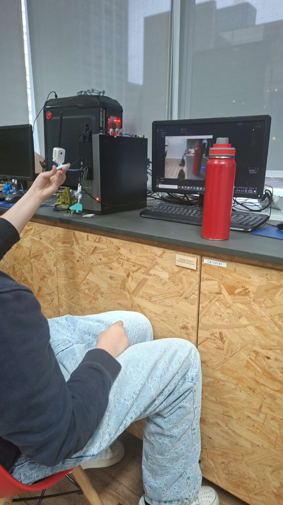
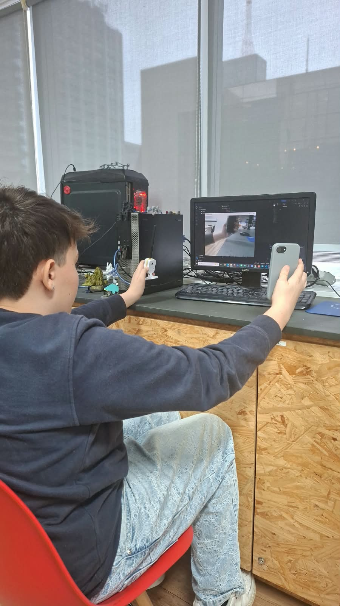
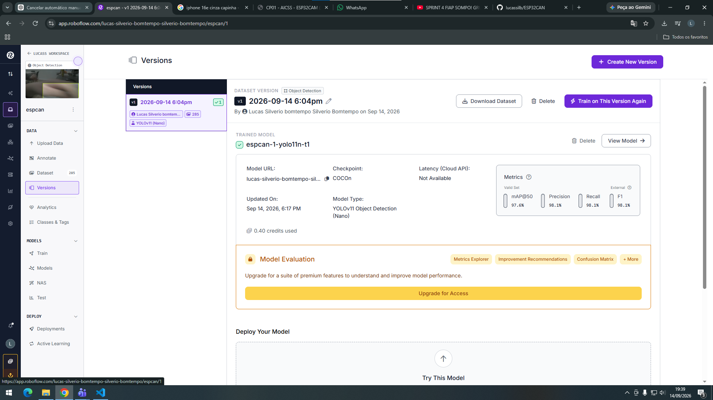

# CP1 - Visão Computacional com ESP32-CAM e YOLO

## Integrantes

| Nome | RM |
|---|---:|
| Lucas Bomtempo | 568585 |
| Caio Apolinario | 569268 |
| Arthur Lins | 570110 |
| Lucas Herrero | 570557 |

## 1. Objetivo

O projeto tem como objetivo desenvolver uma solução de Visão Computacional utilizando uma ESP32-CAM para aquisição de imagens e um modelo YOLO para detecção de objetos.

A ESP32-CAM é utilizada para realizar a captura das imagens. Após a coleta, as imagens são organizadas e anotadas no Roboflow, utilizando bounding boxes para identificar os objetos pertencentes às classes definidas no projeto.

O dataset produzido é utilizado para o treinamento de um modelo YOLOv11 Nano para detecção dos objetos.

## 2. Tecnologias utilizadas

- ESP32-CAM AI Thinker
- MicroPython
- Python
- OpenCV
- Roboflow
- YOLO
- YOLOv11 Nano

## 3. Classes do projeto

O dataset possui duas classes oficiais:

| Classe |
|---|
| phone |
| water_bottle |

As classes utilizadas foram definidas para o projeto e utilizadas durante as etapas de anotação, treinamento e testes.

## 4. Coleta das imagens

As imagens utilizadas no projeto foram coletadas utilizando a ESP32-CAM.

Durante a construção do dataset, foram consideradas variações de ângulo, distância, iluminação, posição dos objetos e fundo, buscando evitar imagens excessivamente repetitivas.

A quantidade de imagens utilizada foi definida de acordo com as orientações do professor.

Após a coleta, as imagens foram organizadas e enviadas para o Roboflow para a etapa de anotação.

## 5. Anotação das imagens

As imagens foram enviadas para o Roboflow e anotadas utilizando bounding boxes.

Cada objeto identificado foi associado à sua respectiva classe:

- `phone`
- `water_bottle`

As bounding boxes foram posicionadas sobre os objetos presentes nas imagens para identificar sua localização e respectiva classe.

## 6. Roboflow

O dataset foi desenvolvido e organizado utilizando o Roboflow.

**Projeto:** `espcan`

**Versão do dataset:** `v1`

**Quantidade de imagens:** 285

**Modelo utilizado no treinamento:** YOLOv11 Nano

## 7. Organização do dataset

O dataset é organizado para utilização com YOLO.

A estrutura contém os diretórios de treinamento, validação e teste, além do arquivo `data.yaml`.

    dataset/
    ├── data.yaml
    ├── train/
    │   ├── images/
    │   └── labels/
    ├── valid/
    │   ├── images/
    │   └── labels/
    └── test/
        ├── images/
        └── labels/

## 8. Firmware

O firmware da ESP32-CAM foi desenvolvido utilizando MicroPython.

Os arquivos do firmware estão localizados na pasta `firmware/`.

    firmware/
    ├── boot.py
    └── main.py

O firmware permite a conexão da ESP32-CAM à rede Wi-Fi e disponibiliza um servidor HTTP para acesso à câmera através do navegador, possibilitando a visualização e captura das imagens.

## 9. Captura das imagens com Python

Além do firmware da ESP32-CAM, foi desenvolvido um script em Python para realizar a captura das imagens através do endereço HTTP disponibilizado pela câmera.

O programa utiliza as bibliotecas `OpenCV`, `Requests` e `NumPy`.

O script realiza as seguintes etapas:

1. Conecta-se ao endereço HTTP da ESP32-CAM.
2. Solicita uma imagem através do endpoint `/capture`.
3. Recebe os dados da imagem.
4. Converte os dados recebidos para uma imagem utilizando OpenCV.
5. Exibe a imagem em uma janela.
6. Salva automaticamente as imagens na pasta `fotos/`.
7. Utiliza timestamp e contador para evitar a sobrescrita dos arquivos.
8. Permite encerrar a captura pressionando a tecla `Q`.

## 10. Treinamento

Foi realizado o treinamento de um modelo de detecção utilizando o YOLOv11 Nano e o dataset desenvolvido no Roboflow.

O modelo treinado foi:

**YOLOv11 Nano**

O treinamento foi realizado utilizando a versão do dataset contendo as imagens anotadas das classes `phone` e `water_bottle`.

## 11. Resultados do treinamento

O modelo treinado apresentou os seguintes resultados no conjunto de validação:

| Métrica | Resultado |
|---|---:|
| mAP@50 | 97,6% |
| Precision | 98,1% |
| Recall | 98,1% |
| F1 | 98,1% |

Esses resultados demonstram um bom desempenho do modelo na identificação dos objetos presentes no dataset.

## 12. Testes de detecção

Após o treinamento, o modelo foi testado utilizando imagens diferentes das utilizadas diretamente durante a captura.

Foram realizados testes com as duas classes do projeto:

- `phone`
- `water_bottle`

Nos testes realizados no Roboflow, o modelo conseguiu identificar os objetos e gerar suas respectivas bounding boxes e níveis de confiança.

Exemplos de detecções realizadas:

- `phone` com aproximadamente 93% de confiança;
- `water_bottle` com aproximadamente 90% de confiança.

## 13. Evidências

As evidências do desenvolvimento do projeto estão disponíveis na pasta `evidencias/`.

### Captura da classe `water_bottle`

A imagem abaixo apresenta a utilização da ESP32-CAM durante a captura de imagens da classe `water_bottle`.

### Captura da classe `phone`

A imagem abaixo apresenta a utilização da ESP32-CAM durante a captura de imagens da classe `phone`.

### Treinamento e métricas do modelo

A imagem abaixo apresenta o treinamento do modelo YOLOv11 Nano e suas principais métricas de desempenho.

As evidências demonstram a utilização da ESP32-CAM na captura das imagens e o treinamento do modelo no Roboflow.

## 14. Estrutura da entrega

A estrutura do projeto está organizada da seguinte maneira:

    CP1/
    ├── firmware/
    │   ├── boot.py
    │   ├── main.py
    │   └── README.md
    │
    ├── evidencias/
    │   ├── fotoCelularCAN.jpeg
    │   ├── fotoGarrafaCAN.jpeg
    │   └── roboflow_treinamento_metricas.png
    │
    ├── dataset/
    │   ├── data.yaml
    │   ├── train/
    │   ├── valid/
    │   └── test/
    │
    └── README.md

## 15. Execução da ESP32-CAM

Para executar o firmware:

1. Configurar o ambiente MicroPython para a ESP32-CAM AI Thinker.
2. Configurar as informações da rede Wi-Fi no código.
3. Enviar os arquivos do firmware para a ESP32-CAM.
4. Executar o programa na placa.
5. Identificar o endereço IP disponibilizado pela ESP32-CAM.
6. Acessar o endereço IP através de um navegador.
7. Utilizar a interface web para visualizar a câmera.

## 16. Execução do script Python

Para executar o programa responsável pela captura das imagens:

1. Instalar o Python.
2. Instalar as bibliotecas necessárias:

       pip install opencv-python requests numpy

3. Configurar no código o endereço IP da ESP32-CAM:

       ESP32_URL = "http://IP_DA_ESP32/capture"

4. Executar o programa:

       python main.py

5. As imagens capturadas serão armazenadas na pasta `fotos/`.
6. Para encerrar a captura, pressionar a tecla `Q`.

## 17. Resultado final

Ao final do processo, foi desenvolvido um dataset de Visão Computacional utilizando imagens capturadas pela ESP32-CAM e posteriormente anotadas no Roboflow.

O dataset possui duas classes oficiais:

- `phone`
- `water_bottle`

O dataset foi utilizado para o treinamento de um modelo YOLOv11 Nano, que apresentou:

- **97,6% de mAP@50**
- **98,1% de Precision**
- **98,1% de Recall**
- **98,1% de F1**

Também foram realizados testes de detecção utilizando imagens das duas classes, demonstrando a capacidade do modelo de identificar os objetos e gerar suas respectivas bounding boxes.

As evidências, códigos e arquivos utilizados no desenvolvimento estão organizados nas respectivas pastas desta entrega.